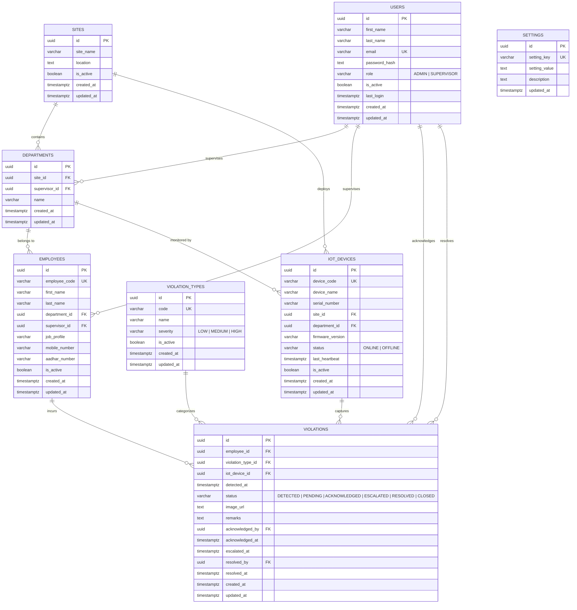

# Database Schema & Design

This document details the PostgreSQL relational database schema, tables, constraints, index strategy, and ER diagram for the PPE Compliance Monitoring System.

---

## 1. Entity-Relationship (ER) Diagram

---

## 2. Table Specifications

### 1. `users`
Stores user credentials for System Administrators and Supervisors.
- **Constraints**: `email` is UNIQUE, `role IN ('ADMIN', 'SUPERVISOR')`.

### 2. `sites`
Represents physical construction or industrial locations.
- **Columns**: `id`, `site_name`, `location`, `is_active`, `created_at`, `updated_at`.

### 3. `departments`
Sub-units or operational zones within a site.
- **Constraints**: `UNIQUE(site_id, name)`. Foreign keys: `site_id` (RESTRICT), `supervisor_id` (SET NULL).

### 4. `employees`
Field workers assigned to departments.
- **Constraints**: `employee_code` is UNIQUE. Foreign keys: `department_id` (RESTRICT), `supervisor_id` (SET NULL).

### 5. `violation_types`
Catalog of safety rules (e.g., `HELMET_MISSING`, `VEST_MISSING`).
- **Constraints**: `code` is UNIQUE, `severity IN ('LOW', 'MEDIUM', 'HIGH')`.

### 6. `iot_devices`
Hardware cameras or edge sensors.
- **Constraints**: `device_code` is UNIQUE, `status IN ('ONLINE', 'OFFLINE')`.

### 7. `violations`
Transactional log of PPE infractions detected by cameras or logged manually.
- **Constraints**: `status IN ('DETECTED', 'PENDING', 'ACKNOWLEDGED', 'ESCALATED', 'RESOLVED', 'CLOSED')`.

### 8. `settings`
Key-value store for global configurations (e.g., `escalation_time_minutes`, `email_notifications`).
- **Constraints**: `setting_key` is UNIQUE.

---

## 3. Database Indexing Strategy

To maintain sub-millisecond query performance as violation logs scale into millions of records:

| Index Name | Table | Target Columns | Primary Usage |
|---|---|---|---|
| `idx_employee_department` | `employees` | `(department_id)` | Fast lookup of employees by department |
| `idx_employee_supervisor` | `employees` | `(supervisor_id)` | Fast lookup of workers under a supervisor |
| `idx_department_site` | `departments` | `(site_id)` | Site department filtering |
| `idx_violation_employee` | `violations` | `(employee_id)` | Employee violation history |
| `idx_violation_status` | `violations` | `(status)` | Dashboard filtering (`PENDING`, `ESCALATED`) |
| `idx_violation_detected` | `violations` | `(detected_at)` | Time-series charts & background escalation scan |
| `idx_iot_status` | `iot_devices` | `(status)` | Real-time device health monitoring |
