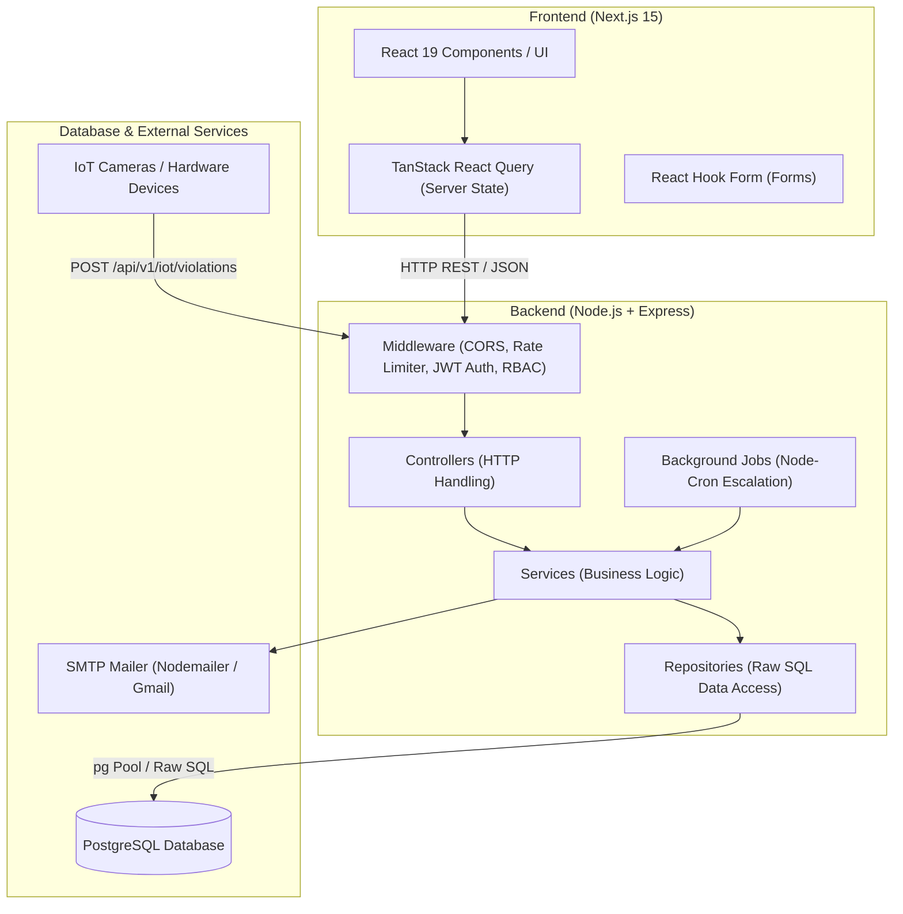

# PPE Compliance Monitoring System - System Architecture Document

This document outlines the high-level system architecture, design patterns, data flow, and security mechanisms of the PPE Compliance Monitoring System.

---

## 1. System Architecture Overview

The platform is designed as a decoupled, multi-tier system composed of a Next.js 15 single-page frontend application, a Node.js + Express backend API, and a PostgreSQL relational database.



---

## 2. Backend Architecture

The backend follows a **Feature-Based Layered Architecture**. Each domain module (e.g., `violations`, `employees`, `departments`) is fully self-contained.

### Modular Directory Breakdown

```
backend/src/
├── config/               # Environment variables & database pool configurations
├── db/                   # Raw SQL connection pool & initial setup
├── jobs/                 # Cron background schedulers (e.g. escalation engine)
├── middleware/           # Auth, RBAC, Rate limiting & Error Handler middleware
├── modules/              # Feature Modules (Domain Driven)
│   ├── analytics/        # Analytics & Compliance trends data handlers
│   ├── auth/             # Login, Register, Password Reset & Token logic
│   ├── dashboard/        # Summary statistics & Overview data
│   ├── departments/      # Department management module
│   ├── employees/        # Employee CRUD & Bulk Import handling
│   ├── settings/         # System preferences & escalation thresholds
│   ├── sites/            # Construction site management
│   ├── supervisors/      # Supervisor management module
│   ├── violation-types/  # Violation categories & severity mapping
│   └── violations/       # Core IoT violation ingestion, ACK & Resolution
├── shared/               # Cross-cutting concerns (ApiResponse, AppError, EmailService)
└── server.ts             # Express application entry point & route definitions
```

### Layer Responsibilities

```
Route ──► Validation Middleware ──► Controller ──► Service ──► Repository ──► PostgreSQL
```

1. **Route Layer (`*.route.ts`)**: Defines REST endpoints, maps HTTP verbs, and attaches middleware (`authenticate`, `authorize(['ADMIN'])`).
2. **Validation Layer (`*.validation.ts`)**: Uses `express-validator` to enforce strict input types and schemas before passing requests to controllers.
3. **Controller Layer (`*.controller.ts`)**: Parses HTTP requests, extracts parameters, invokes service methods, and formats standardized JSON responses using `ApiResponse`.
4. **Service Layer (`*.service.ts`)**: Contains core business rules, transactional logic, cross-module operations, and email triggers.
5. **Repository Layer (`*.repository.ts`)**: Executes parameterized SQL queries directly against PostgreSQL using the `pg` connection pool. No ORM is used to ensure maximum performance and precise query control.
6. **Types Layer (`*.types.ts`)**: TypeScript interfaces enforcing strong typing across the entire pipeline.

### Background Worker & Escalation Engine
- **Scheduler**: Utilizes `node-cron` running background jobs (`escalation.job.ts`) every minute.
- **Workflow**: Scans for `PENDING` violations exceeding configured supervisor action timeouts, transitions their status to `ESCALATED`, and sends asynchronous notifications to system administrators via `emailService`.

---

## 3. Frontend Architecture

The frontend is built on **Next.js 15 App Router** using a **Feature-Driven Structure**.

### Modular Directory Breakdown

```
src/
├── app/                  # Next.js App Router Pages, Routing & Global Layouts
├── components/ui/        # Shared Reusable Design System (CustomSelect, Modal, Button, etc.)
├── features/             # Feature Slices (Domain Driven Modules)
│   ├── auth/             # Login, Register, Forgot/Reset Password flows
│   ├── dashboard/        # Summary Stats, Trend Charts & Recent Activity
│   ├── departments/      # Department CRUD & Assignment
│   ├── employees/        # Employee CRUD & Bulk Import (CSV)
│   ├── iot-simulator/    # Mock IoT Camera Trigger & Hardware Payload Test Bench
│   ├── settings/         # System Preferences & Escalation Timeout Configs
│   ├── sites/            # Construction Site Management
│   ├── supervisors/      # Supervisor Management
│   ├── violation-types/  # Violation Categories, Severity & Thresholds
│   └── violations/       # Real-time Violation Feed, ACK & Resolution
├── hooks/                # Global Reusable React Hooks
├── layouts/              # Core App Shell, Sidebar Navigation & Header Bar
├── services/             # Axios API Instance, Global Interceptors & Token Queue
├── shared/               # Shared Constants & Reusable UI Layout Elements
├── types/                # Global TypeScript Definitions & API Response Types
└── utils/                # Utility Helper Functions & Formatter Modules
```

### State Management & Data Fetching
- **Server State**: Managed exclusively via **TanStack Query (React Query v5)**. Automatic caching, background refetching, and query invalidation upon successful mutations.
- **Form State**: Managed using **React Hook Form** paired with custom UI components (e.g., `CustomSelect`).
- **Global Error Handling**: Standardized Axios interceptors catch 401/403 unauthorized responses, redirecting users to the login flow automatically.

---

## 4. Security & Data Protection

1. **Authentication & Session**:
   - Stateless **JWT (JSON Web Tokens)** used for authentication.
   - Dual-token strategy: Short-lived Access Tokens (1h) and Refresh Tokens (7d).
   - Passwords hashed using **Bcrypt** with salt rounds.

2. **Role-Based Access Control (RBAC)**:
   - **`ADMIN`**: Full permissions across all sites, departments, employees, settings, and violations.
   - **`SUPERVISOR`**: Restricted read/update permissions scoped specifically to their assigned department and workers.

3. **Database Security**:
   - Zero ORM usage; all queries use parameterized SQL inputs (`$1`, `$2`) to eliminate SQL Injection risks completely.

---

## 5. Coding Standards & Conventions

### General Principles
- Follow **SOLID** principles across all layers.
- Clean Architecture: no business logic in controllers, no SQL outside repositories.
- Prefer readability over clever abstractions. No duplicate code.

### Backend Standards
- Feature-based layered structure: `route → validation → controller → service → repository`.
- Business logic lives exclusively in the **Service** layer.
- SQL queries live exclusively in the **Repository** layer using parameterized inputs.
- Centralized error handling via `AppError` class and global `errorHandler` middleware.
- Input validation using `express-validator` middleware chains.

### Frontend Standards
- Strict TypeScript with zero `any` types across the entire codebase.
- **Tailwind CSS** for all styling — no inline styles or external CSS libraries.
- **React Hook Form** for form state management with custom UI components.
- **TanStack Query** for all server state — no `useEffect` data fetching patterns.
- Feature-based file organization: each feature contains its own `components/`, `hooks/`, `services/`, `validation/`, and `types/`.

