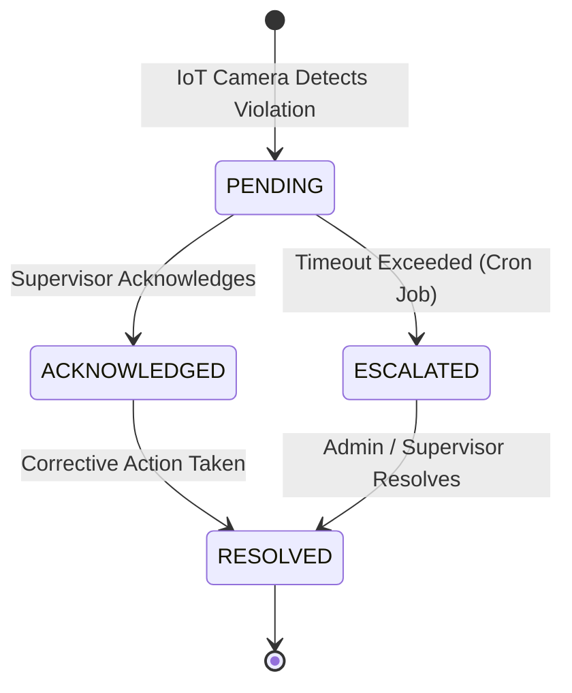
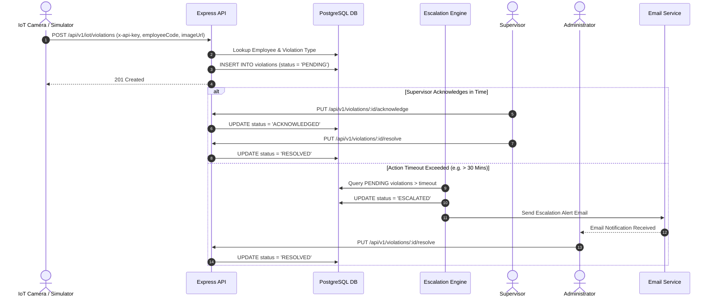

# PPE Compliance Monitoring System - Business Flow & Workflows

This document details the end-to-end business workflows, user interactions, automated background engines, and state lifecycles within the PPE Compliance Monitoring System.

---

## 1. Violation Lifecycle State Machine

Each PPE violation progresses through a strictly controlled state machine driven by human intervention or automated escalation rules.

---

## 2. End-to-End Ingestion & Escalation Sequence

---

## 3. Workflow Details

### Workflow A: Authentication & Password Recovery

1. **Login Flow**:
   - User inputs credentials (`email`, `password`) at `/login`.
   - API verifies bcrypt password hash and generates an Access Token (1h) + Refresh Token (7d).
   - Client stores token and redirects to `/dashboard` based on user role (`ADMIN` or `SUPERVISOR`).
2. **Password Recovery**:
   - User requests reset link via `/forgot-password`.
   - System generates a secure reset token, saves it with an expiration timestamp, and emails the user.
   - User clicks email link, submits new password via `/reset-password`, and token is invalidated.

---

### Workflow B: IoT Detection & Ingestion

1. **Detection**:
   - An edge AI camera detects a non-compliant worker (e.g., missing safety helmet or vest).
2. **Payload Submission**:
   - The device posts to `/api/v1/iot/violations` passing `employeeCode`, `violationTypeCode`, `imageUrl`, and `x-api-key`.
3. **Record Creation**:
   - The system verifies the worker code and violation category, maps them to the correct site/department, and creates a `PENDING` record.

---

### Workflow C: Supervisor Actioning & Resolution

1. **Dashboard Alert**:
   - Supervisor views real-time violation feed filtered to their assigned department.
2. **Acknowledgement**:
   - Supervisor clicks "Acknowledge" to signal active investigation (`status -> ACKNOWLEDGED`).
3. **Resolution**:
   - Supervisor inspects the physical site, provides equipment or safety counseling, enters resolution notes, and clicks "Resolve" (`status -> RESOLVED`).

---

### Workflow D: Automated Background Escalation

1. **Cron Execution**:
   - Background worker (`escalation.job.ts`) executes every 60 seconds.
2. **Timeout Calculation**:
   - Reads `escalation_time_minutes` from system settings (default: 30 minutes).
3. **Escalation Trigger**:
   - Identifies any violation that has remained in `PENDING` status longer than the allowed timeout.
   - Updates status to `ESCALATED`.
   - Fetches all active `ADMIN` email addresses and sends asynchronous email alerts via Gmail SMTP.

---

### Workflow E: Organization Setup & Worker Management

1. **Site & Department Hierarchy**:
   - Administrator creates Construction Sites and defines sub-departments within each site.
2. **Supervisor Assignment**:
   - Admin creates Supervisor accounts and assigns them to monitor specific departments.
3. **Employee Onboarding**:
   - Workers are registered individually or bulk-imported via CSV files (`/api/v1/employees/bulk-import`).